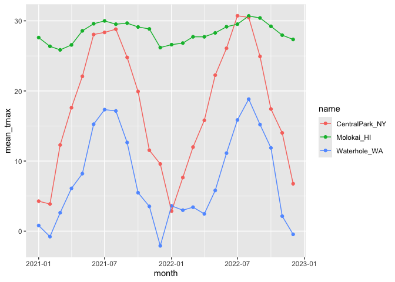

Exploratory Analysis
================
Kaleb J. Frierson
2024-10-03

- [Notes](#notes)
- [Coding](#coding)
  - [Library Calling](#library-calling)
  - [Data Import](#data-import)
  - [Plotting](#plotting)
  - [group_by()](#group_by)
  - [2x2 tables](#2x2-tables)
  - [general numeric summaries](#general-numeric-summaries)
  - [grouped mutates](#grouped-mutates)
- [FAS dataset](#fas-dataset)

# Notes

group_by() + summarize()

group_by says here is a category that I want to define and then adds a
layer ontop of the dataframe that can act transparently unless you call
upon it. It is based on existing variables, changes the behavior of some
key functions, and is not exactly invisible but is easy to miss.

summarize() allows you to compute one-number summaries. It is also based
on existing variables and is most useful in conjunction with group_by().

Exploratory data analysis requires some caution: you should have an
analytic plan before doing exploratory analysis so that you don’t bias
your findings. Most statistical tests assume you’re only concnerned
about the current hypothesis or that you’ve done appropriate adjustments
for multiple tests/analyses.

# Coding

## Library Calling

``` r
library(tidyverse)
```

## Data Import

``` r
weather_df = 
  rnoaa::meteo_pull_monitors(
    c("USW00094728", "USW00022534", "USS0023B17S"),
    var = c("PRCP", "TMIN", "TMAX"), 
    date_min = "2021-01-01",
    date_max = "2022-12-31") |>
  mutate(
    name = case_match(
      id, 
      "USW00094728" ~ "CentralPark_NY", 
      "USW00022534" ~ "Molokai_HI",
      "USS0023B17S" ~ "Waterhole_WA"),
    tmin = tmin / 10,
    tmax = tmax / 10,
    month = lubridate::floor_date(date, unit = "month")) |>
  select(name, id, everything())
```

## Plotting

Lets make some plots:

``` r
weather_df |> 
  ggplot(aes(x=prcp)) +
  geom_histogram()
```

    ## `stat_bin()` using `bins = 30`. Pick better value with `binwidth`.

    ## Warning: Removed 15 rows containing non-finite outside the scale range
    ## (`stat_bin()`).

<!-- -->

``` r
weather_df |> 
  filter(prcp>1000) 
```

    ## # A tibble: 3 × 7
    ##   name           id          date        prcp  tmax  tmin month     
    ##   <chr>          <chr>       <date>     <dbl> <dbl> <dbl> <date>    
    ## 1 CentralPark_NY USW00094728 2021-08-21  1130  27.8  22.8 2021-08-01
    ## 2 CentralPark_NY USW00094728 2021-09-01  1811  25.6  17.2 2021-09-01
    ## 3 Molokai_HI     USW00022534 2022-12-18  1120  23.3  18.9 2022-12-01

``` r
weather_df |> 
  filter(tmax > 20, tmax < 30) |> 
  ggplot(aes(x= tmin, y= tmax, color = name, shape = name)) + 
  geom_point()
```

<!-- -->

Why are central park and molokai each at one whole number while
waterhole is all over the place when it comes to decimals? There might
be a reporting difference between parks. If we dig into it, central park
and molokai are possible reporting in farenheit, converting to celcius,
then rounding to some set threshold. Waterhole is probs reporting
straight in celcius.

## group_by()

``` r
weather_df |> 
  group_by(name)
```

    ## # A tibble: 2,190 × 7
    ## # Groups:   name [3]
    ##    name           id          date        prcp  tmax  tmin month     
    ##    <chr>          <chr>       <date>     <dbl> <dbl> <dbl> <date>    
    ##  1 CentralPark_NY USW00094728 2021-01-01   157   4.4   0.6 2021-01-01
    ##  2 CentralPark_NY USW00094728 2021-01-02    13  10.6   2.2 2021-01-01
    ##  3 CentralPark_NY USW00094728 2021-01-03    56   3.3   1.1 2021-01-01
    ##  4 CentralPark_NY USW00094728 2021-01-04     5   6.1   1.7 2021-01-01
    ##  5 CentralPark_NY USW00094728 2021-01-05     0   5.6   2.2 2021-01-01
    ##  6 CentralPark_NY USW00094728 2021-01-06     0   5     1.1 2021-01-01
    ##  7 CentralPark_NY USW00094728 2021-01-07     0   5    -1   2021-01-01
    ##  8 CentralPark_NY USW00094728 2021-01-08     0   2.8  -2.7 2021-01-01
    ##  9 CentralPark_NY USW00094728 2021-01-09     0   2.8  -4.3 2021-01-01
    ## 10 CentralPark_NY USW00094728 2021-01-10     0   5    -1.6 2021-01-01
    ## # ℹ 2,180 more rows

Counting stuff:

``` r
weather_df |> 
  group_by(name) |> 
  summarize(n_obs = n())
```

    ## # A tibble: 3 × 2
    ##   name           n_obs
    ##   <chr>          <int>
    ## 1 CentralPark_NY   730
    ## 2 Molokai_HI       730
    ## 3 Waterhole_WA     730

``` r
weather_df |> 
  group_by(name) |> 
  summarize(n_obs = n(), n_dist = n_distinct(month))
```

    ## # A tibble: 3 × 3
    ##   name           n_obs n_dist
    ##   <chr>          <int>  <int>
    ## 1 CentralPark_NY   730     24
    ## 2 Molokai_HI       730     24
    ## 3 Waterhole_WA     730     24

There is a special one-off function that does counting by group that you
define, in the below case we use name.

``` r
weather_df |> 
  count(name)
```

    ## # A tibble: 3 × 2
    ##   name               n
    ##   <chr>          <int>
    ## 1 CentralPark_NY   730
    ## 2 Molokai_HI       730
    ## 3 Waterhole_WA     730

## 2x2 tables

``` r
weather_df |> 
  drop_na(tmax) |> 
  filter(name != "Molokai_HI") |> 
  mutate(
    cold = case_when(
      tmax < 5 ~ "cold", 
      tmax >=5 ~ "not_cold"
    )
  ) |> 
  group_by(name, cold) |> 
  summarize(count = n())
```

    ## `summarise()` has grouped output by 'name'. You can override using the
    ## `.groups` argument.

    ## # A tibble: 4 × 3
    ## # Groups:   name [2]
    ##   name           cold     count
    ##   <chr>          <chr>    <int>
    ## 1 CentralPark_NY cold        96
    ## 2 CentralPark_NY not_cold   634
    ## 3 Waterhole_WA   cold       319
    ## 4 Waterhole_WA   not_cold   395

``` r
weather_df |> 
  drop_na(tmax) |> 
  filter(name != "Molokai_HI") |> 
  mutate(
    cold = case_when(
      tmax < 5 ~ "cold", 
      tmax >=5 ~ "not_cold"
    )
  ) |> 
  janitor::tabyl(name, cold)
```

    ##            name cold not_cold
    ##  CentralPark_NY   96      634
    ##    Waterhole_WA  319      395

## general numeric summaries

Useful summaries:

``` r
weather_df |> 
  group_by(name) |> 
  summarize(
    mean_tmax = mean(tmax, na.rm = TRUE), 
    median_tmin = median(tmin, na.rm = TRUE), 
    sd_prcp = sd(prcp, na.rm = TRUE) 
  )
```

    ## # A tibble: 3 × 4
    ##   name           mean_tmax median_tmin sd_prcp
    ##   <chr>              <dbl>       <dbl>   <dbl>
    ## 1 CentralPark_NY     17.7         10     113. 
    ## 2 Molokai_HI         28.3         20.6    63.2
    ## 3 Waterhole_WA        7.38        -0.6   111.

could also do it by month:

``` r
weather_df |> 
  group_by(month) |> 
  summarize(
    mean_tmax = mean(tmax, na.rm = TRUE), 
    median_tmin = median(tmin, na.rm = TRUE), 
    sd_prcp = sd(prcp, na.rm = TRUE) 
  )
```

    ## # A tibble: 24 × 4
    ##    month      mean_tmax median_tmin sd_prcp
    ##    <date>         <dbl>       <dbl>   <dbl>
    ##  1 2021-01-01     10.9         0.6    113. 
    ##  2 2021-02-01      9.82       -1.65    83.4
    ##  3 2021-03-01     13.7         5      107. 
    ##  4 2021-04-01     16.8         8.05    37.0
    ##  5 2021-05-01     19.6        11.1     48.1
    ##  6 2021-06-01     24.3        17.8     38.6
    ##  7 2021-07-01     25.2        21.1     96.6
    ##  8 2021-08-01     25.2        21.1    141. 
    ##  9 2021-09-01     22.4        17.5    200. 
    ## 10 2021-10-01     18.2        13.9    112. 
    ## # ℹ 14 more rows

or with name and month, then you can plot on the new dataframe too.

``` r
weather_df |> 
  group_by(name, month) |> 
  summarize(
    mean_tmax = mean(tmax, na.rm = TRUE), 
    median_tmin = median(tmin, na.rm = TRUE), 
    sd_prcp = sd(prcp, na.rm = TRUE) 
  ) |> 
  ggplot(aes(x= month, y= mean_tmax, color = name)) + 
  geom_point()+
  geom_line()
```

    ## `summarise()` has grouped output by 'name'. You can override using the
    ## `.groups` argument.

<!-- -->
The above shows seasonal variation in each of the three weather stations
but its more summarized with the criteria that we set.

Format for readers:

``` r
weather_df |> 
  group_by(name, month) |> 
  summarize(
    mean_tmax = mean(tmax, na.rm = TRUE)
  ) |> 
  pivot_wider(
  names_from = name, 
  values_from = mean_tmax
  ) |> 
  knitr::kable(digits=3,
               col.names = c("Month", "Central Park", "Molokai", "Waterhole")
  )
```

    ## `summarise()` has grouped output by 'name'. You can override using the
    ## `.groups` argument.

| Month      | Central Park | Molokai | Waterhole |
|:-----------|-------------:|--------:|----------:|
| 2021-01-01 |        4.271 |  27.616 |     0.800 |
| 2021-02-01 |        3.868 |  26.368 |    -0.786 |
| 2021-03-01 |       12.294 |  25.861 |     2.623 |
| 2021-04-01 |       17.607 |  26.567 |     6.097 |
| 2021-05-01 |       22.084 |  28.577 |     8.203 |
| 2021-06-01 |       28.057 |  29.587 |    15.253 |
| 2021-07-01 |       28.352 |  29.994 |    17.335 |
| 2021-08-01 |       28.810 |  29.523 |    17.152 |
| 2021-09-01 |       24.787 |  29.673 |    12.647 |
| 2021-10-01 |       19.926 |  29.129 |     5.481 |
| 2021-11-01 |       11.537 |  28.847 |     3.533 |
| 2021-12-01 |        9.587 |  26.190 |    -2.097 |
| 2022-01-01 |        2.855 |  26.606 |     3.606 |
| 2022-02-01 |        7.650 |  26.829 |     2.989 |
| 2022-03-01 |       11.990 |  27.726 |     3.416 |
| 2022-04-01 |       15.810 |  27.723 |     2.463 |
| 2022-05-01 |       22.255 |  28.283 |     5.810 |
| 2022-06-01 |       26.090 |  29.157 |    11.127 |
| 2022-07-01 |       30.723 |  29.529 |    15.861 |
| 2022-08-01 |       30.500 |  30.697 |    18.830 |
| 2022-09-01 |       24.923 |  30.413 |    15.207 |
| 2022-10-01 |       17.426 |  29.223 |    11.884 |
| 2022-11-01 |       14.017 |  27.960 |     2.140 |
| 2022-12-01 |        6.761 |  27.348 |    -0.460 |

Once you’ve added the grouping layer on top of your df, there are other
things you can do as well!

## grouped mutates

``` r
weather_df |> 
  group_by(name) |> 
  mutate(mean_tmax = mean(tmax, na.rm = TRUE))
```

    ## # A tibble: 2,190 × 8
    ## # Groups:   name [3]
    ##    name           id          date        prcp  tmax  tmin month      mean_tmax
    ##    <chr>          <chr>       <date>     <dbl> <dbl> <dbl> <date>         <dbl>
    ##  1 CentralPark_NY USW00094728 2021-01-01   157   4.4   0.6 2021-01-01      17.7
    ##  2 CentralPark_NY USW00094728 2021-01-02    13  10.6   2.2 2021-01-01      17.7
    ##  3 CentralPark_NY USW00094728 2021-01-03    56   3.3   1.1 2021-01-01      17.7
    ##  4 CentralPark_NY USW00094728 2021-01-04     5   6.1   1.7 2021-01-01      17.7
    ##  5 CentralPark_NY USW00094728 2021-01-05     0   5.6   2.2 2021-01-01      17.7
    ##  6 CentralPark_NY USW00094728 2021-01-06     0   5     1.1 2021-01-01      17.7
    ##  7 CentralPark_NY USW00094728 2021-01-07     0   5    -1   2021-01-01      17.7
    ##  8 CentralPark_NY USW00094728 2021-01-08     0   2.8  -2.7 2021-01-01      17.7
    ##  9 CentralPark_NY USW00094728 2021-01-09     0   2.8  -4.3 2021-01-01      17.7
    ## 10 CentralPark_NY USW00094728 2021-01-10     0   5    -1.6 2021-01-01      17.7
    ## # ℹ 2,180 more rows

This demonstrates that the grouping function when working in the
tidyverse stays with your dataframe. If later on you get weird results
it might be because you forgot that you grouped. So making a grouping
permenant is a bad idea. Better in exploratory analysis than when making
an analytic dataset.

``` r
weather_df |> 
  group_by(name) |> 
  mutate(
    mean_tmax = mean(tmax, na.rm = TRUE), 
    centered_tmax = tmax - mean_tmax) |> 
  ggplot(aes(x = date, y = centered_tmax, color = name)) + 
  geom_point() 
```

    ## Warning: Removed 17 rows containing missing values or values outside the scale range
    ## (`geom_point()`).

<!-- -->

``` r
weather_df |> 
  mutate(
    temp_rank = min_rank(tmax)
  ) |> 
  filter(temp_rank <10)
```

    ## # A tibble: 10 × 8
    ##    name           id          date        prcp  tmax  tmin month      temp_rank
    ##    <chr>          <chr>       <date>     <dbl> <dbl> <dbl> <date>         <int>
    ##  1 CentralPark_NY USW00094728 2022-01-15     0  -6   -12.1 2022-01-01         7
    ##  2 CentralPark_NY USW00094728 2022-12-24     0  -9.3 -13.8 2022-12-01         4
    ##  3 Waterhole_WA   USS0023B17S 2021-02-11    51  -5.6 -10.9 2021-02-01         9
    ##  4 Waterhole_WA   USS0023B17S 2021-12-26   102 -11.4 -18.3 2021-12-01         1
    ##  5 Waterhole_WA   USS0023B17S 2021-12-27    25  -9.8 -19.6 2021-12-01         2
    ##  6 Waterhole_WA   USS0023B17S 2021-12-28     0  -6   -11.4 2021-12-01         7
    ##  7 Waterhole_WA   USS0023B17S 2021-12-29   102  -7.9 -15.4 2021-12-01         6
    ##  8 Waterhole_WA   USS0023B17S 2022-02-22   102  -9.3 -16.6 2022-02-01         4
    ##  9 Waterhole_WA   USS0023B17S 2022-12-18     0  -5.6 -11.3 2022-12-01         9
    ## 10 Waterhole_WA   USS0023B17S 2022-12-21     0  -9.6 -18.4 2022-12-01         3

You can also change the way you rank things, use “desc” in the new
variable statement with min_rank: temp_rank = min_ranl(desc(tmax))

``` r
pulse_data = 
  haven::read_sas("data_import_examples/public_pulse_data.sas7bdat") |>
  janitor::clean_names() |>
  pivot_longer(
    bdi_score_bl:bdi_score_12m,
    names_to = "visit", 
    names_prefix = "bdi_score_",
    values_to = "bdi") |>
  select(id, visit, everything()) |>
  mutate(
    visit = replace(visit, visit == "bl", "00m"),
    visit = factor(visit, levels = str_c(c("00", "01", "06", "12"), "m"))) |>
  arrange(id, visit)

pulse_data |> 
  group_by(visit) |> 
  summarize(
    mean_bdi = mean(bdi, na.rm = TRUE),
    median_bdi = median(bdi, na.rm = TRUE)) |> 
  knitr::kable(digits = 3)
```

| visit | mean_bdi | median_bdi |
|:------|---------:|-----------:|
| 00m   |    7.995 |          6 |
| 01m   |    6.046 |          4 |
| 06m   |    5.672 |          4 |
| 12m   |    6.097 |          4 |

``` r
pup_data = 
  read_csv("data_import_examples/FAS_pups.csv") |>
  janitor::clean_names() |>
  mutate(sex = recode(sex, `1` = "male", `2` = "female")) 
```

    ## Rows: 313 Columns: 6
    ## ── Column specification ────────────────────────────────────────────────────────
    ## Delimiter: ","
    ## chr (2): Litter Number, PD ears
    ## dbl (4): Sex, PD eyes, PD pivot, PD walk
    ## 
    ## ℹ Use `spec()` to retrieve the full column specification for this data.
    ## ℹ Specify the column types or set `show_col_types = FALSE` to quiet this message.

``` r
litter_data = 
    read_csv("data_import_examples/FAS_litters.csv") |>
  janitor::clean_names() |>
  separate(group, into = c("dose", "day_of_tx"), sep = 3)
```

    ## Rows: 49 Columns: 8
    ## ── Column specification ────────────────────────────────────────────────────────
    ## Delimiter: ","
    ## chr (4): Group, Litter Number, GD0 weight, GD18 weight
    ## dbl (4): GD of Birth, Pups born alive, Pups dead @ birth, Pups survive
    ## 
    ## ℹ Use `spec()` to retrieve the full column specification for this data.
    ## ℹ Specify the column types or set `show_col_types = FALSE` to quiet this message.

``` r
fas_data = left_join(pup_data, litter_data, by = "litter_number") 

fas_data |> 
  group_by(dose, day_of_tx) |> 
  drop_na(dose) |> 
  summarize(mean_pivot = mean(pd_pivot, na.rm = TRUE)) |> 
  pivot_wider(
    names_from = dose, 
    values_from = mean_pivot) |> 
  knitr::kable(digits = 3)
```

    ## `summarise()` has grouped output by 'dose'. You can override using the
    ## `.groups` argument.

| day_of_tx |   Con |   Low |   Mod |
|:----------|------:|------:|------:|
| 7         | 7.000 | 7.939 | 6.984 |
| 8         | 6.236 | 7.721 | 7.042 |

# FAS dataset

``` r
litters_df = 
  read_csv("data_import_examples/FAS_litters.csv", na = c("NA", "", ".")) |> 
  janitor::clean_names() |> 
  separate(
    group, into = c("dose", "tx_day"), sep=3
  )
```

    ## Rows: 49 Columns: 8
    ## ── Column specification ────────────────────────────────────────────────────────
    ## Delimiter: ","
    ## chr (2): Group, Litter Number
    ## dbl (6): GD0 weight, GD18 weight, GD of Birth, Pups born alive, Pups dead @ ...
    ## 
    ## ℹ Use `spec()` to retrieve the full column specification for this data.
    ## ℹ Specify the column types or set `show_col_types = FALSE` to quiet this message.

``` r
pups_df = 
  read_csv("data_import_examples/FAS_pups.csv", na = c("NA", "", ".")) |> 
  janitor::clean_names() 
```

    ## Rows: 313 Columns: 6
    ## ── Column specification ────────────────────────────────────────────────────────
    ## Delimiter: ","
    ## chr (1): Litter Number
    ## dbl (5): Sex, PD ears, PD eyes, PD pivot, PD walk
    ## 
    ## ℹ Use `spec()` to retrieve the full column specification for this data.
    ## ℹ Specify the column types or set `show_col_types = FALSE` to quiet this message.

``` r
fas_df = 
  left_join(pups_df, litters_df, by = "litter_number")
```

Compute a table we care about:

``` r
fas_df |> 
  drop_na(dose) |> 
  group_by(dose, tx_day) |> 
  summarize(mean_pivot = mean(pd_pivot, na.rm = TRUE)) |> 
  pivot_wider(
    names_from = tx_day, 
    values_from = mean_pivot
  ) |> 
  knitr::kable(digits=2)
```

    ## `summarise()` has grouped output by 'dose'. You can override using the
    ## `.groups` argument.

| dose |    7 |    8 |
|:-----|-----:|-----:|
| Con  | 7.00 | 6.24 |
| Low  | 7.94 | 7.72 |
| Mod  | 6.98 | 7.04 |
